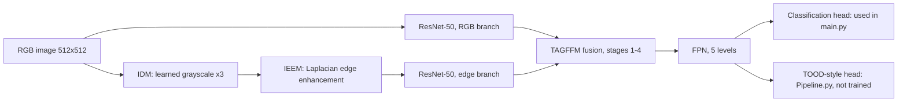

# Underwater Object Detection Pipeline (COMP 541 course project)

PyTorch code for underwater object detection on the RUOD dataset: a dual-stream ResNet-50 backbone with edge enhancement and gated feature fusion, plus a TOOD-style detection head.

[](https://github.com/sarpvulas/COMP541_CourseProject/actions/workflows/tests.yml)
[](LICENSE)

## TL;DR

Underwater images are blurry and low in contrast, which makes standard detectors less reliable. This project combines each image with an edge-enhanced grayscale copy in a two-branch ResNet-50, fuses the branches with learned gates, and adds a TOOD-style head for detection. The training script that is wired up today (`main.py`) trains only an image-level, single-label classifier on top of that backbone, so there are no detection mAP results yet.

## Results

TODO(sarp): add mAP results and the figure. The repository contains no measured results: `modules/evaluation.py` computes top-1 accuracy of a single label per image and returns `0.0` placeholders for AP, AP50, AP75, APs, APm and APl.

## What is in the repo

| Part | File | Status |
|------|------|--------|
| Illumination/grayscale module (IDM) | `modules/IDM.py` | Used by both pipelines |
| Edge enhancement module (IEEM, Laplacian + conv blocks) | `modules/IEEM.py` | Used by both pipelines |
| Dual ResNet-50 (RGB branch and edge branch, ImageNet-initialised, weights not shared) | `modules/dual_backbone.py` | Used by both pipelines |
| Gated fusion of the two branches (TAGFFM) per ResNet stage | `modules/TAGFFM.py` | Used by both pipelines; sizes hard-coded for 512x512 input |
| FPN (torchvision) | `modules/Pipeline*.py` | Used by both pipelines |
| Classification head | `MultiClassHead.py`, `modules/Pipeline_OnlyClassify.py` | Trained by `main.py` |
| TOOD-style head | `TOODHead.py`, `modules/Pipeline.py` | Forward pass only; not trained (see Limitations) |
| Anchors, IoU, matching, box decoding, GIoU | `modules/anchor_utils.py` | Unit tested |
| Anchor-based detection loss (cross-entropy + GIoU) | `losses.py` (`detection_loss`) | Not used by `main.py` |
| COCO-format data loading | `utils.py` | Used |

## Method



The TOOD-style head (`TOODHead.py`) follows the structure of TOOD (Feng et al., ICCV 2021, https://arxiv.org/abs/2108.07755): stacked convolutions, task decomposition with layer attention for the classification and regression branches, and a classification score aligned with a learned alignment map. The task decomposition code is adapted from MMDetection (see Credits). It is a partial implementation: the paper's task-aligned label assignment and its losses are not implemented, and the deformable-offset module is created inside `forward` rather than registered as a layer (see Limitations).

What `main.py` does today: for each image it center-crops to 512x512, keeps boxes that are at least 50% inside the crop, picks the one class whose boxes cover the largest total area, and trains the classification head with cross-entropy on the spatially and scale-averaged logits. It evaluates top-1 accuracy on the test split, logs to Weights & Biases, and saves a checkpoint to `models/checkpoints/` when accuracy improves.

## Tech stack

Python 3.12, PyTorch, torchvision (ResNet-50, FPN, `CocoDetection`), pycocotools, Weights & Biases, matplotlib. `mmcv` is needed only for the TOOD-style head.

## Quickstart

Tested on macOS, Python 3.12.2, CPU only.

```bash
git clone https://github.com/sarpvulas/COMP541_CourseProject.git
cd COMP541_CourseProject
python -m venv .venv && source .venv/bin/activate
pip install -r requirements.txt
pip install pytest
python -m pytest -q          # 28 passed
```

Forward and backward pass of the classification pipeline on one random 512x512 image (downloads the ResNet-50 ImageNet weights on first run):

```bash
python - <<'EOF'
import torch
from modules.Pipeline_OnlyClassify import FullPipeline_OnlyClassify
from losses import single_label_classification_loss
m = FullPipeline_OnlyClassify(num_classes=10)
out = m(torch.rand(1, 3, 512, 512))
print([tuple(o.shape) for o in out])
loss = single_label_classification_loss(out, [{"labels": torch.tensor(3)}])
loss.backward()
EOF
```

Training (`python main.py`) needs the RUOD dataset and a Weights & Biases login. It was not run for this README because the dataset is not in the repository.

## Reproducibility notes

- Data: RUOD in COCO format (10 classes, `NUM_CLASSES = 10` in `modules/config.py`). Edit the four paths in `modules/dataset_paths.txt` (`TRAIN_IMAGES_PATH`, `TRAIN_ANNOTATIONS_PATH`, `TEST_IMAGES_PATH`, `TEST_ANNOTATIONS_PATH`); the committed values are paths on the author's machine. Category ids are assumed to start at 1.
- Settings in `modules/config.py`: batch size 2, learning rate 1e-4, 10 epochs, AdamW with weight decay 1e-4, StepLR (step 2, gamma 0.5).
- `utils.load_data` trains and tests on a random 500-image subset of each split and drops images smaller than 512 pixels on either side. No random seed is set, so runs are not repeatable.
- Dependency versions used for the checks above are listed in `requirements.txt`.

## Limitations

- No detection metrics. `main.py` trains and evaluates a single-label classifier; AP values are placeholders.
- The TOOD-style head has no label assignment or loss, and its offset module (`reg_offset_module` in `TOODHead.forward`) is rebuilt with random weights on every forward call, so it cannot be trained. `modules/Pipeline.py` and `TOODHead.py` were not run here because `mmcv` was not installed.
- `losses.detection_loss` averages a pairwise GIoU matrix instead of paired boxes, and is not used by `main.py`.
- TAGFFM hard-codes the 512x512 feature sizes of the four ResNet stages.
- Inputs are not normalised with ImageNet statistics.
- No mAP table or figure from the course report is included.

## Related

The benchmark of existing detectors on the UODReview platform (MMDetection-based, by Long Chen et al.) for this course is in [sarpvulas/COMP541-Project](https://github.com/sarpvulas/COMP541-Project).

## License and credits

Apache License 2.0, see [LICENSE](LICENSE). The repository is licensed under Apache-2.0 because `TOODHead.py` contains code adapted from [MMDetection](https://github.com/open-mmlab/mmdetection) (OpenMMLab, Apache-2.0).

- TOOD: Feng et al., "TOOD: Task-aligned One-stage Object Detection", ICCV 2021.
- MMDetection: task decomposition module in `TOODHead.py`.
- ResNet-50 weights and FPN from torchvision.
- Course project for COMP 541 Deep Learning, Koç University.

Author: Sarp Vulaş, Dubai. MSc Computational Finance, King's College London.
